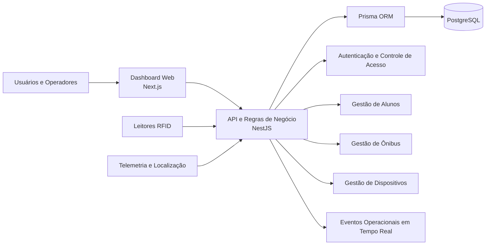
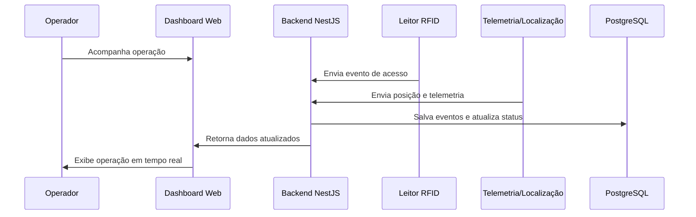
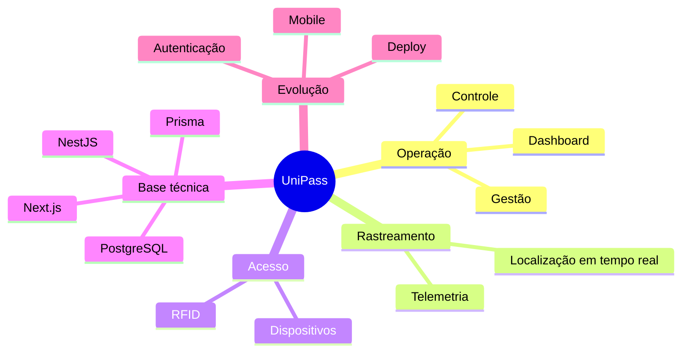

# UniPass

Plataforma criada para resolver um problema real de operação no transporte: conectar gestão, rastreamento e controle de acesso em uma experiência simples, segura e preparada para escalar.

> A proposta do UniPass é transformar processos espalhados em uma plataforma única, capaz de centralizar operação, monitoramento e tomada de decisão.

## Visão Geral

O `UniPass` foi pensado para atender a rotina real de quem opera transporte diariamente. Em vez de depender de fluxos fragmentados, controles manuais e pouca visibilidade da operação, a solução reúne dashboard web, gestão de alunos, ônibus, usuários e dispositivos, além de integração com RFID, telemetria e localização em tempo real.

Mais do que um sistema com telas administrativas, o projeto foi estruturado com visão de produto: arquitetura web moderna, base consistente para autenticação, organização de dados, deploy e evolução futura para o mobile.

## Problema que o Projeto Resolve

Antes de uma plataforma como o UniPass, é comum encontrar:

- processos operacionais separados em ferramentas diferentes;
- dificuldade para acompanhar veículos e acessos em tempo real;
- pouca rastreabilidade de eventos;
- baixa visibilidade para gestão;
- controles frágeis de usuários, dispositivos e permissões.

O UniPass nasce para unificar esse cenário em uma única solução.

## O que a Plataforma Entrega

- Dashboard web para acompanhamento da operação.
- Gestão centralizada de alunos, ônibus, usuários e dispositivos.
- Controle de acesso com integração RFID.
- Rastreamento e telemetria em tempo real.
- Estrutura segura para autenticação e evolução contínua do produto.
- Base preparada para expansão futura para experiência mobile.

## Visão de Produto

| Pilar              | Objetivo                                       | Valor gerado                                |
| ------------------ | ---------------------------------------------- | ------------------------------------------- |
| Gestão             | Centralizar cadastros e operação               | Menos retrabalho e mais controle            |
| Rastreamento       | Acompanhar localização e eventos em tempo real | Maior visibilidade operacional              |
| Controle de acesso | Registrar entradas com RFID e dispositivos     | Mais segurança e rastreabilidade            |
| Escalabilidade     | Sustentar crescimento do produto               | Base pronta para novas integrações e mobile |

## Arquitetura Resumida

| Camada         | Tecnologia                     | Papel no projeto                                    |
| -------------- | ------------------------------ | --------------------------------------------------- |
| Frontend       | Next.js                        | Dashboard web, navegação e experiência da operação  |
| Backend        | NestJS                         | Regras de negócio, APIs, autenticação e integrações |
| Banco de dados | PostgreSQL                     | Persistência estruturada dos dados operacionais     |
| ORM            | Prisma                         | Modelagem, acesso e manutenção dos dados            |
| Integrações    | RFID, telemetria e localização | Entrada de eventos e monitoramento em tempo real    |
| Deploy         | Base preparada para publicação | Evolução contínua e ambiente pronto para crescer    |

## Diagrama de Arquitetura

## Fluxo Operacional

## Módulos do Sistema

| Módulo       | Responsabilidade                                         | Impacto na operação                          |
| ------------ | -------------------------------------------------------- | -------------------------------------------- |
| Dashboard    | Exibir visão consolidada da operação                     | Decisão mais rápida e monitoramento contínuo |
| Alunos       | Organizar e manter o cadastro dos usuários transportados | Base confiável para acesso e gestão          |
| Ônibus       | Centralizar dados dos veículos                           | Melhor controle da frota                     |
| Usuários     | Controlar perfis e acessos ao sistema                    | Mais segurança administrativa                |
| Dispositivos | Gerenciar leitores e equipamentos integrados             | Operação mais confiável                      |
| RFID         | Registrar acessos e eventos                              | Rastreabilidade e automação                  |
| Telemetria   | Capturar localização e movimentação                      | Monitoramento em tempo real                  |

## Diferenciais do Projeto

- Produto pensado a partir de uma dor operacional real.
- Plataforma única para gestão, monitoramento e controle.
- Arquitetura moderna com separação clara entre frontend e backend.
- Base pronta para autenticação, deploy e crescimento do sistema.
- Estrutura desenhada para evoluir do web para o mobile.
- Forte aderência a uso real, e não apenas a um protótipo visual.

## Roadmap do Produto

| Status        | Etapa                    | Descrição                                               |
| ------------- | ------------------------ | ------------------------------------------------------- |
| Concluído     | Dashboard web            | Base visual da operação e acompanhamento dos dados      |
| Concluído     | Gestão centralizada      | Cadastros de alunos, ônibus, usuários e dispositivos    |
| Concluído     | Integração RFID          | Controle de acesso com leitura de eventos               |
| Concluído     | Telemetria e localização | Monitoramento operacional em tempo real                 |
| Concluído     | Base técnica sólida      | Next.js, NestJS, PostgreSQL e Prisma                    |
| Em evolução   | Segurança e expansão     | Consolidação da autenticação e evolução da operação     |
| Próximo passo | Experiência mobile       | Expansão do produto para uso em app                     |
| Próximo passo | Monitoramento avançado   | Evoluir a experiência em tempo real e visão operacional |

## Resumo Visual do Escopo

## Próximos Passos

- expandir a experiência para mobile;
- aprofundar o monitoramento em tempo real;
- evoluir alertas e inteligência operacional;
- fortalecer ainda mais segurança e governança de acesso;
- ampliar integrações conforme a operação crescer.

## Conclusão

O UniPass representa mais do que um painel administrativo: ele é uma base de produto construída para resolver uma necessidade real de operação. A proposta combina visão técnica e visão de negócio para transformar gestão, rastreamento e controle de acesso em uma experiência mais clara, segura e escalável.
